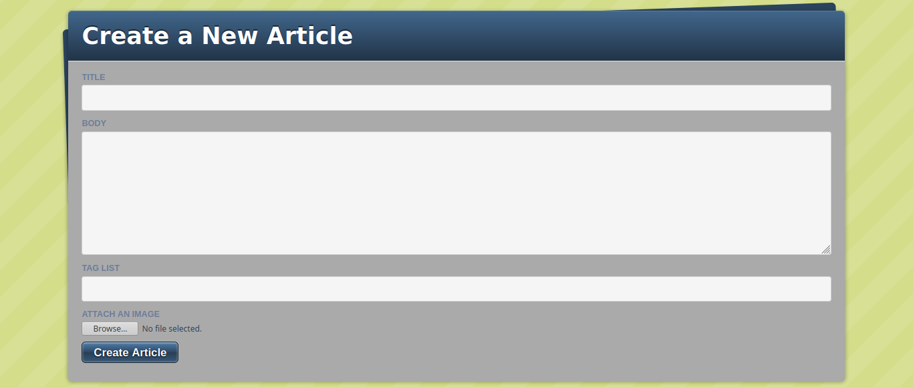

[](https://lbesson.mit-license.org/)
[](http://makeapullrequest.com)
[](https://github.com/ellerbrock/open-source-badges/)


# Blogger

> A simple starter blog template which may be customised further.



## Live Demo

[Live Demo Link](https://blogger-template.herokuapp.com/)

## Functionality

- Create Article
- Tag Article
- Upload Image for Article
- Edit Article
- Delete Article
- View Articles by Tags

## :toolbox: Tools & Technologies Used

- Ruby v2.6.5
- Ruby on Rails v5.2.4.3

## :rocket: Getting Started

### Prerequisites

- Ruby
- Ruby on Rails
- PostgreSQL

### Configuration

1. [Install Ruby](https://www.ruby-lang.org/en/documentation/installation/)
2. Install Ruby on Rails
```
gem install rails -v 5.2.3
```
3. [Install PostgreSQL](https://www.postgresql.org/docs/9.3/tutorial-install.html)
4. Clone repo into your local environment using your favourite terminal:
```
git clone [this-repo-url].git
```
5. Open project directory
```
cd directory-name
```
6. Bulk install dependencies
```
bundle install
```
7. Set up database
```
rake db:create:all
```
```
rake db:migrate
```
8. Run App Locally
```
rails server
```
Then go to `http://localhost:3000` in your browser
9. Deploy to a platform of your choice. Example Deployment to Heroku
```
heroku create
```
```
git push heroku master
```
```
heroku run rake db:migrate
```
10. Congrats if you've made it this far in one piece! It's now time to visit your blog
```
heroku open
```

## Author

👤 **Clifton Davies**

- Github: [@githubhandle](https://github.com/cliftondavies)
- Twitter: [@twitterhandle](https://twitter.com/cliftonaedavies)
- Linkedin: [linkedin](https://www.linkedin.com/in/clifton-davies-mbcs/)

## 🤝 Contributing

Contributions, issues and feature requests are welcome!

1. Fork it
2. Create feature branch
`git checkout -b feature/fooBar`
3. Commit changes
`git commit -am 'Add some fooBar'`
4. Push to the branch
`git push origin feature/fooBar`
5. Create new Pull Request

## Show your support

Give a ⭐️ if you like this project!

## Acknowledgments

- T
- The Beagles
- Jump Start Lab

## 📝 Copyright & License

Copyright (c) 2020 Clifton Davies.
This project is licensed under [MIT](https://opensource.org/licenses/MIT). See LICENSE file for details.